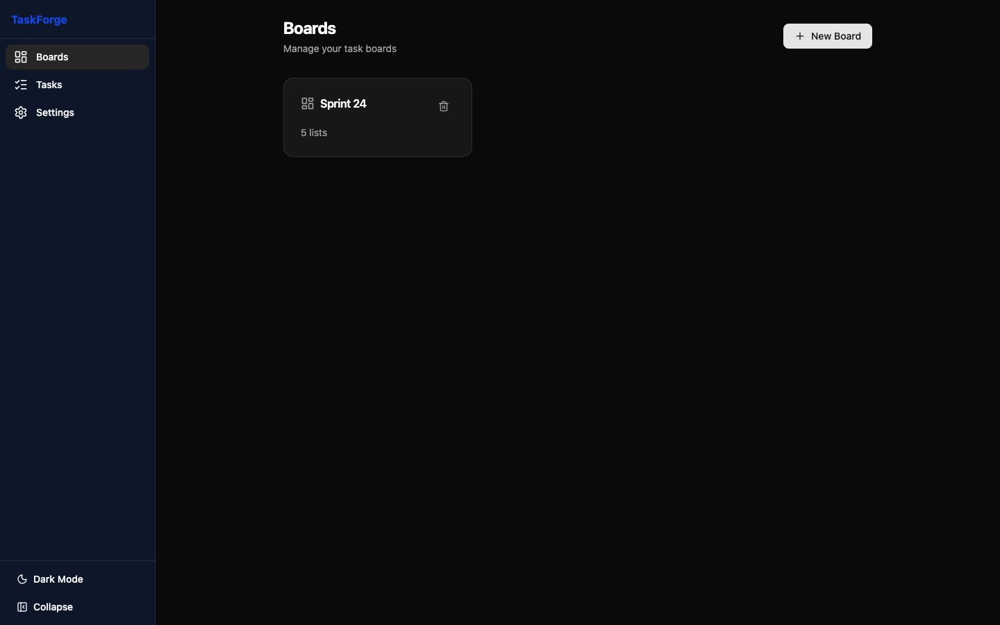
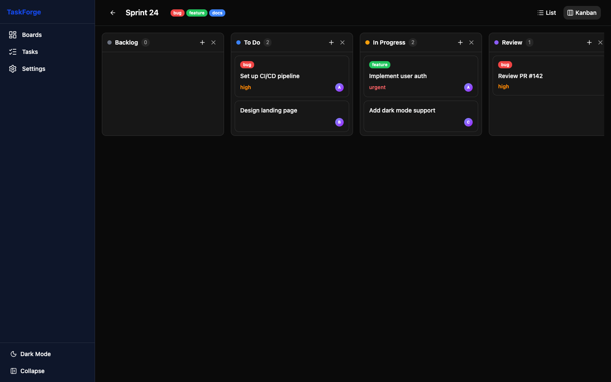
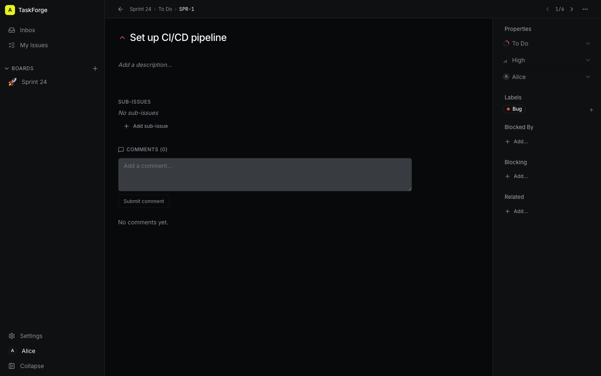

# TaskForge

**A multi-user task tracker built for humans and AI agents to collaborate on the same boards.**

TaskForge is a full-stack task management application with three interfaces — REST API, MCP Server (for AI agents), and a Kanban SPA — all running in a single NestJS backend. It's designed so that any MCP-compatible agent (Claude Code, Cursor, GitHub Copilot, etc.) can do everything a human can: create boards, move tasks, assign work, comment, search, and more.

---

## Features

- **Authentication** — Email/password login, session tokens, invite-only signup, bot tokens for agents, admin/member roles
- **Onboarding** — First-run setup creates the admin account and instance title
- **Kanban Board** — Drag-and-drop columns with Backlog → To Do → In Progress → Review → Done
- **List View** — Table view for quick scanning across all lists
- **Task Detail** — Edit title, description, priority, assignee, due date, labels; dedicated route per task
- **Sub-tasks** — Nest tasks under a parent task
- **Task Relations** — Link tasks with `blocks` / `related_to` relationships
- **Per-board Task Numbers** — Each task gets a sequential board-scoped id (e.g. `TF-12`)
- **Comments** — Threaded discussion on any task, attributed to the authenticated user
- **Labels** — Color-coded tags per board, assignable to tasks
- **Activity Log** — Full audit trail per task and per board
- **Real-time Updates** — WebSocket events push changes to all connected clients instantly (auth-required)
- **Full-text Search** — Search across task titles and descriptions, or by task number
- **MCP Protocol** — AI agents connect via the Streamable HTTP transport to do everything humans can
- **Priority System** — Low / Medium / High / Urgent with visual indicators
- **WIP Limits** — Optional per-list work-in-progress limits
- **Soft Delete** — Tasks archive instead of hard-deleting
- **Single Container** — Everything (API + SPA + WebSocket) in one Docker image

---

## Screenshots

| Home Page | Kanban Board |
|-----------|-------------|
|  |  |

| List View | Task Detail |
|-----------|-------------|
|  |  |

---

## Architecture

```
┌─────────────────────────────────────────────────────┐
│                   TaskForge Container               │
│                                                      │
│  ┌──────────────────────────────────────────────┐   │
│  │              NestJS Backend (:3000)            │   │
│  │                                               │   │
│  │  ┌──────────┐  ┌──────────┐  ┌────────────┐  │   │
│  │  │ REST API │  │ MCP API  │  │ WebSocket  │  │   │
│  │  │ /api/*   │  │ /api/mcp │  │ /ws        │  │   │
│  │  └──────────┘  └──────────┘  └────────────┘  │   │
│  │                                               │   │
│  │  ┌──────────────────────────────────────────┐ │   │
│  │  │  AuthGuard (Bearer session tokens,        │ │   │
│  │  │  @Public exceptions, @Admin routes)        │ │   │
│  │  └──────────────────────────────────────────┘ │   │
│  │                                               │   │
│  │  ┌──────────────────────────────────────────┐ │   │
│  │  │         Prisma ORM → SQLite              │ │   │
│  │  └──────────────────────────────────────────┘ │   │
│  │                                               │   │
│  │  ┌──────────────────────────────────────────┐ │   │
│  │  │  React SPA (served as static assets)    │ │   │
│  │  └──────────────────────────────────────────┘ │   │
│  └──────────────────────────────────────────────┘   │
└─────────────────────────────────────────────────────┘
```

### Data Model

```
User
  ├── Sessions (Bearer tokens; bot sessions flagged)
  ├── InviteTokens (created by admin, single-use)
  └── Memberships (per-board role: admin/member/viewer)

Settings (singleton — instance title, onboarded flag)

Board
  ├── identifier (3-letter prefix for task numbers, e.g. TF)
  ├── nextTaskNum (sequential counter)
  ├── Lists (ordered by position)
  │    ├── Tasks (ordered by position, board-scoped number)
  │    │    ├── Comments (attributed to a User)
  │    │    ├── Activity (audit log, attributed to a User)
  │    │    ├── Labels (many-to-many via TaskLabel)
  │    │    ├── Sub-tasks (self-relation via parentId)
  │    │    └── Relations (blocks / related_to via TaskRelation)
  │    └── WIP Limit (optional)
  ├── Labels (board-level)
  └── Members (board-level)
```

---

## Quick Start

### Prerequisites

- **Node.js** >= 20
- **pnpm** >= 10 (install with `corepack enable && corepack prepare pnpm@10.12.1 --activate`)

### Docker (fastest)

```bash
docker run -d --name taskforge -p 3000:3000 -v taskforge-data:/data emreyc/taskforge:latest
```

Open **http://localhost:3000** and follow the onboarding prompt to create the admin account. The SQLite database is persisted in the `taskforge-data` volume at `/data/taskforge.db`.

### Local Development

```bash
# Clone
git clone https://github.com/emreycolakoglu/taskforge.git
cd taskforge

# Install dependencies
pnpm install

# Generate Prisma client and apply migrations
cd apps/api
pnpm prisma:generate
pnpm prisma:migrate
cd ../..

# Start development servers (API on :3000, Web on :5173 with proxy)
pnpm dev
```

The API runs on `http://localhost:3000` and the Vite dev server on `http://localhost:5173` (proxied to the API). On first visit the SPA redirects to `/onboarding` to create the admin account.

### Docker (Production, from source)

```bash
# Build and run (exposes :4321 by default via docker-compose)
docker compose up --build

# Or build manually
docker build -t taskforge .
docker run -p 3000:3000 -v taskforge-data:/data taskforge
```

Then open **http://localhost:4321** (compose) or **http://localhost:3000** (manual run) in your browser. The first visit triggers onboarding.

---

## Configuration

All configuration is via environment variables:

| Variable | Default | Description |
|----------|---------|-------------|
| `PORT` | `3000` | HTTP server port |
| `DATABASE_URL` | `file:./prisma/dev.db` | SQLite database path. In Docker, use `file:/data/taskforge.db` for persistence |
| `CORS_ORIGIN` | `*` | Allowed CORS origin(s) |
| `MCP_ALLOWED_ORIGINS` | `http://localhost:3000,http://localhost:5173,http://127.0.0.1:3000,http://127.0.0.1:5173` | Comma-separated origins allowed for browser MCP requests (DNS-rebinding protection) |
| `MCP_REQUIRE_ORIGIN` | `1` | Set to `0` to skip origin checks entirely |
| `NODE_ENV` | `development` | Set to `production` for production mode |

### .env file

```env
PORT=3000
DATABASE_URL=file:./prisma/dev.db
CORS_ORIGIN=*
```

---

## Authentication

All REST endpoints (except a few `@Public` ones) require a `Authorization: Bearer <token>` header. Sessions are UUID tokens stored in the DB with a 90-day expiry (365 days for bot tokens).

### Auth Endpoints (`/api/auth`)

| Method | Endpoint | Auth | Description |
|--------|----------|------|-------------|
| `GET` | `/api/auth/status` | Public | Whether instance is onboarded + instance title |
| `POST` | `/api/auth/onboard` | Public | First-run setup; creates admin user + settings |
| `POST` | `/api/auth/login` | Public | Login with email/password, returns session token |
| `POST` | `/api/auth/logout` | Authenticated | Revokes current session |
| `POST` | `/api/auth/invite` | Admin | Create a single-use invite token (7-day expiry) |
| `POST` | `/api/auth/signup/:token` | Public | Sign up via invite token; returns session |
| `POST` | `/api/auth/bot-token` | Admin | Create a long-lived bot session token for agents |
| `GET` | `/api/auth/me` | Authenticated | Current user |
| `PATCH` | `/api/auth/me` | Authenticated | Update display name / change password |
| `GET` | `/api/auth/users` | Admin | List all users |
| `GET` | `/api/auth/invites` | Admin | List all invite tokens |
| `DELETE` | `/api/auth/invites/:id` | Admin | Revoke an invite token |

### Settings Endpoints (`/api/settings`)

| Method | Endpoint | Auth | Description |
|--------|----------|------|-------------|
| `GET` | `/api/settings` | Admin | Full settings |
| `GET` | `/api/settings/initialized` | Public | `{ initialized }` (used by health check) |
| `GET` | `/api/settings/title` | Public | Instance title |
| `PUT` | `/api/settings` | Admin | Update settings |

---

## REST API

All endpoints are under `/api` and require a Bearer token (see [Authentication](#authentication)). Request and response bodies are JSON.

### Boards

| Method | Endpoint | Description |
|--------|----------|-------------|
| `GET` | `/api/boards` | List all boards |
| `GET` | `/api/boards/:id` | Get board with lists and labels |
| `GET` | `/api/boards/:id/full` | Get board with lists, tasks, labels, members |
| `POST` | `/api/boards` | Create a board (auto-creates 5 default lists) |
| `PUT` | `/api/boards/:id` | Update board name/slug/identifier/description |
| `DELETE` | `/api/boards/:id` | Delete board and all its data |

**Create a board:**
```json
{ "name": "My Project", "slug": "my-project", "identifier": "MYP", "description": "Optional" }
```

> `identifier` is a 3-letter uppercase prefix used for per-board task numbers (e.g. `MYP-1`).

### Lists

| Method | Endpoint | Description |
|--------|----------|-------------|
| `GET` | `/api/lists/board/:boardId` | List all lists in a board |
| `GET` | `/api/lists/:id` | Get a single list |
| `POST` | `/api/lists` | Create a list |
| `PUT` | `/api/lists/:id` | Update list name/color/wipLimit/position |
| `PUT` | `/api/lists/reorder` | Reorder lists |
| `DELETE` | `/api/lists/:id` | Delete list and its tasks |

**Create a list:**
```json
{ "boardId": "...", "name": "In Progress", "color": "#f59e0b", "wipLimit": 5 }
```

### Tasks

| Method | Endpoint | Description |
|--------|----------|-------------|
| `GET` | `/api/tasks/board/:boardId` | List tasks in a board (`?include=all\|top\|sub`, `?parentId=`) |
| `GET` | `/api/tasks/list/:listId` | List tasks in a specific list (same query params) |
| `GET` | `/api/tasks/search?q=query` | Full-text search across tasks (also matches task numbers like `TF-12`) |
| `GET` | `/api/tasks/:id` | Get task with comments, activity, labels, sub-tasks, relations |
| `POST` | `/api/tasks` | Create a task |
| `PUT` | `/api/tasks/:id` | Update task fields |
| `PUT` | `/api/tasks/:id/move` | Move task to another list |
| `PUT` | `/api/tasks/reorder` | Reorder tasks within a list |
| `POST` | `/api/tasks/:taskId/labels/:labelId` | Attach a label to a task |
| `DELETE` | `/api/tasks/:taskId/labels/:labelId` | Detach a label from a task |
| `DELETE` | `/api/tasks/:id` | Archive a task (soft delete) |

**Create a task:**
```json
{
  "listId": "...",
  "title": "Implement login page",
  "description": "Add email/password and OAuth login",
  "priority": "high",
  "assigneeId": "user-id",
  "dueDate": "2026-07-01T00:00:00Z",
  "parentId": "parent-task-id",
  "labelIds": ["label-id-1", "label-id-2"],
  "metadata": "any JSON string"
}
```

**Move a task:**
```json
{ "listId": "new-list-id", "position": 0 }
```

### Task Relations

Relations are scoped under a task. `blocks` is directed; `related_to` is undirected (canonicalized).

| Method | Endpoint | Description |
|--------|----------|-------------|
| `GET` | `/api/tasks/:taskId/relations` | List relations for a task |
| `POST` | `/api/tasks/:taskId/relations` | Create a relation |
| `DELETE` | `/api/tasks/:taskId/relations/:relationId` | Delete a relation |

**Create a relation:**
```json
{ "otherTaskId": "other-task-id", "type": "blocks", "direction": "source" }
```

> `direction: "source"` means the path task blocks the other; `"target"` means the path task is blocked by the other. Defaults to `"source"`. Ignored for `related_to`.

### Comments

| Method | Endpoint | Description |
|--------|----------|-------------|
| `GET` | `/api/comments/task/:taskId` | List comments on a task |
| `POST` | `/api/comments` | Add a comment (attributed to the authenticated user) |
| `DELETE` | `/api/comments/:id` | Delete a comment |

**Add a comment:**
```json
{ "taskId": "...", "body": "Looks good to me!" }
```

### Labels

Labels are nested under a board for creation/listing.

| Method | Endpoint | Description |
|--------|----------|-------------|
| `GET` | `/api/boards/:boardId/labels` | List labels on a board |
| `POST` | `/api/boards/:boardId/labels` | Create a label |
| `PATCH` | `/api/labels/:id` | Update label name/color |
| `DELETE` | `/api/labels/:id` | Delete a label |

**Create a label:**
```json
{ "name": "bug", "color": "#ef4444" }
```

### Activity

| Method | Endpoint | Description |
|--------|----------|-------------|
| `GET` | `/api/activity/task/:taskId` | Activity log for a task |
| `GET` | `/api/activity/board/:boardId` | Activity log for an entire board |

---

## MCP Server (AI Agent Interface)

TaskForge implements the **MCP (Model Context Protocol)** over the **Streamable HTTP transport** (2025-03-26 spec) at `POST /api/mcp`. Any MCP-compatible agent (Claude Code, Cursor, GitHub Copilot, opencode, etc.) can connect and perform all the same operations a human can.

### Authentication

The MCP endpoint is behind the global `AuthGuard`. Agents must send a Bearer session token. The token can be:

- A **user session token** (from `POST /api/auth/login`)
- A **bot token** created by an admin via `POST /api/auth/bot-token` (365-day expiry, recommended for agents)

```bash
# Admin creates a bot token
curl -X POST http://localhost:3000/api/auth/bot-token \
  -H "Authorization: Bearer <admin-token>"
# → { "id": "...", "token": "bot-uuid", "expiresAt": "..." }
```

### How Agents Connect

**Claude Code / Cursor / Copilot** — Add to your MCP config:

```json
{
  "mcpServers": {
    "taskforge": {
      "url": "http://localhost:3000/api/mcp",
      "headers": { "Authorization": "Bearer <bot-token>" }
    }
  }
}
```

The Streamable HTTP transport requires an `initialize` handshake that returns an `Mcp-Session-Id` header; subsequent requests must include that header. Most MCP clients handle this automatically.

### Available MCP Tools

#### Boards
| Tool | Params | Description |
|------|--------|-------------|
| `boards_list` | `{}` | List all boards with list and member counts |
| `boards_get` | `{ id }` | Get board with lists, tasks, labels |
| `boards_create` | `{ name, slug, identifier?, description? }` | Create board with 5 default lists |
| `boards_delete` | `{ id }` | Delete board |

#### Lists
| Tool | Params | Description |
|------|--------|-------------|
| `lists_list` | `{ boardId }` | List all lists in a board |
| `lists_create` | `{ boardId, name, position?, color?, wipLimit? }` | Create a list |
| `lists_update` | `{ id, name?, color?, wipLimit? }` | Update a list |
| `lists_delete` | `{ id }` | Delete a list |

#### Tasks
| Tool | Params | Description |
|------|--------|-------------|
| `tasks_list` | `{ boardId?, listId?, assigneeId?, status?, parentId?, include?, limit? }` | List tasks with filters |
| `tasks_get` | `{ id }` | Get task with comments, activity, labels, sub-tasks, relations |
| `tasks_search` | `{ query }` | Full-text search or task-number lookup (e.g. `TF-12`) |
| `tasks_create` | `{ listId, title, description?, priority?, assigneeId?, dueDate?, parentId?, labelIds?, position?, metadata? }` | Create a task (assignee defaults to caller) |
| `tasks_update` | `{ id, title?, description?, priority?, status?, assigneeId?, dueDate?, listId?, position?, parentId?, labelIds? }` | Update a task (`parentId: null` un-nests) |
| `tasks_move` | `{ id, listId, position? }` | Move task to another list |
| `tasks_delete` | `{ id }` | Archive a task |

#### Comments
| Tool | Params | Description |
|------|--------|-------------|
| `comments_list` | `{ taskId }` | List comments on a task |
| `comments_create` | `{ taskId, body }` | Add a comment (attributed to caller) |

#### Labels
| Tool | Params | Description |
|------|--------|-------------|
| `labels_list` | `{ boardId }` | List labels on a board |
| `labels_create` | `{ boardId, name, color? }` | Create a label |
| `labels_delete` | `{ id }` | Delete a label |

#### Activity
| Tool | Params | Description |
|------|--------|-------------|
| `activity_list` | `{ taskId?, boardId?, limit? }` | Get activity log |

#### Relations
| Tool | Params | Description |
|------|--------|-------------|
| `relations_list` | `{ taskId }` | List blocking/blockedBy/relatedTo relations for a task |
| `relations_create` | `{ taskId, otherTaskId, type, direction? }` | Create a `blocks` or `related_to` relation |
| `relations_delete` | `{ relationId }` | Delete a relation |

### Example: Agent Creates a Board and Tasks

```json
// 1. Create a board
→ {"method":"tools/call","params":{"name":"boards_create","arguments":{"name":"Sprint 24","slug":"sprint-24","identifier":"SPR"}},"id":1}
← {"jsonrpc":"2.0","id":1,"result":{...}}

// 2. Create a task in the "To Do" list
→ {"method":"tools/call","params":{"name":"tasks_create","arguments":{"listId":"...","title":"Design API schema","priority":"high","assigneeId":"alice-id"}},"id":2}
← {"jsonrpc":"2.0","id":2,"result":{...}}

// 3. Move task to "In Progress"
→ {"method":"tools/call","params":{"name":"tasks_move","arguments":{"id":"...","listId":"in-progress-list-id"}},"id":3}
← {"jsonrpc":"2.0","id":3,"result":{...}}

// 4. Search for tasks
→ {"method":"tools/call","params":{"name":"tasks_search","arguments":{"query":"API"}},"id":4}
← {"jsonrpc":"2.0","id":4,"result":[{...}]}
```

---

## WebSocket Events

The WebSocket server at `/ws` pushes real-time events to connected clients. **Authentication is required** — clients must emit an `auth` message with a session token within 5 seconds of connecting:

```javascript
const ws = new WebSocket('ws://localhost:3000/ws');
ws.onopen = () => {
  ws.send(JSON.stringify({ event: 'auth', data: { token: '<session-token>', boardId: 'board-123' } }));
};
ws.onmessage = (event) => {
  const { event: name, data } = JSON.parse(event.data);
  console.log(name, data);
};
```

On success the server emits `auth_success`; on failure it emits `auth_error` and disconnects. Providing `boardId` joins the board's event room.

### Event Types

| Event | Payload | When |
|-------|---------|------|
| `board:created` | Board object | A new board is created |
| `board:updated` | Board object | A board is renamed/updated |
| `board:deleted` | `{ id }` | A board is deleted |
| `list:created` | List object | A new list is added |
| `list:updated` | List object | A list is renamed/recolored |
| `list:reordered` | Reorder result | Lists are reordered |
| `list:deleted` | `{ id }` | A list is deleted |
| `task:created` | Task object | A new task is created |
| `task:updated` | Task object | A task is edited |
| `task:moved` | Task object | A task is moved to another list |
| `task:deleted` | `{ id }` | A task is archived |
| `task.label.attached` | Task object | A label is attached to a task |
| `task.label.detached` | Task object | A label is detached from a task |
| `comment:created` | Comment object | A comment is added |
| `comment:deleted` | `{ id }` | A comment is deleted |
| `label:created` | Label object | A new label is created |
| `label:updated` | Label object | A label is renamed/recolored |
| `label:deleted` | `{ id }` | A label is deleted |
| `relation:created` | Relation object | A task relation is created |
| `relation:deleted` | `{ id }` | A task relation is deleted |

---

## Frontend (SPA)

The React SPA is served by the NestJS backend in production. In development, Vite proxies API and WebSocket requests to the backend.

### Routes

| Route | View |
|-------|------|
| `/onboarding` | First-run admin setup |
| `/login` | Login form |
| `/signup/:token` | Invite-based signup |
| `/` | Home — board list with create/delete |
| `/board/:id` | Kanban board with task cards, labels, priority indicators, assignees |
| `/board/:id/settings` | Board settings (labels, members) |
| `/board/:boardId/task/:taskId` | Task detail page (edit fields, activity log, comments, sub-tasks, relations) |
| `/tasks` | List view — sortable table across all tasks |
| `/settings` | Admin settings |
| `/account` | Account settings (display name, password) |

### Tech Stack

- React 19 + TypeScript (strict)
- React Router 7
- Vite 6 (dev server with proxy)
- Tailwind CSS 4 + shadcn/ui (Radix primitives)
- TanStack Query (server state)
- `@hello-pangea/dnd` (drag and drop)
- Socket.IO client (real-time events)
- Sonner (toasts), Lucide icons

> The SPA follows a dark "midnight command deck" design system with a single Acid Lime accent. See [`design.md`](./design.md) before any frontend change.

---

## Docker

### Building

```bash
# Using docker-compose (recommended — exposes :4321)
docker compose up --build

# Manual build
docker build -t taskforge .
```

The Dockerfile uses multi-stage builds:
1. **base** — Node 23 Alpine + pnpm
2. **deps** — Install all dependencies
3. **builder** — Generate Prisma client, build API and SPA
4. **runner** — Minimal production image with SQLite persistence at `/data`

### Volumes

> **Data loss warning:** The SQLite database lives at `/data/taskforge.db` inside the container. Without a persistent volume mounted at `/data`, **every redeploy recreates the container and wipes the database**. This is true for `docker run`, `docker compose up`, Coolify, and any container orchestrator.

Mount a volume at `/data` to persist the SQLite database:

```yaml
volumes:
  - taskforge-data:/data
```

The Dockerfile declares `VOLUME ["/data"]` so anonymous Docker storage is created automatically on `docker run` without `-v` — but anonymous volumes are per-container and do **not** survive `docker rm` or image redeploys. For real persistence, use a **named volume** or a **bind mount**:

```bash
# Named volume (recommended)
docker run -d --name taskforge -p 3000:3000 -v taskforge-data:/data emreyc/taskforge:latest

# Bind mount (for backups / host access)
docker run -d --name taskforge -p 3000:3000 -v /opt/taskforge-data:/data emreyc/taskforge:latest
```

### Health Check

The container includes a health check that pings `GET /api/settings/initialized` every 30 seconds.

### Migrations on Startup

`docker-entrypoint.sh` runs `prisma migrate deploy` before starting the app, so schema changes ship with the image. To ship a schema change: run `pnpm --filter @taskforge/api prisma:migrate -- --name <desc>` locally, commit the new migration file, and push.

---

## Development

### Project Structure

```
taskforge/
├── apps/
│   ├── api/                       # NestJS backend (CommonJS)
│   │   ├── prisma/
│   │   │   ├── schema.prisma      # Database schema
│   │   │   └── migrations/        # Prisma migrations
│   │   ├── docker-entrypoint.sh   # Runs migrations then starts node
│   │   └── src/
│   │       ├── main.ts            # Entry (SPA serving + CORS + validation)
│   │       ├── app.module.ts       # Root module
│   │       ├── prisma/            # Prisma client service (@Global)
│   │       ├── auth/              # Users, sessions, invites, bot tokens, AuthGuard
│   │       ├── settings/          # Instance settings (singleton)
│   │       ├── boards/            # Boards module (REST)
│   │       ├── lists/             # Lists module (REST)
│   │       ├── tasks/             # Tasks module (REST)
│   │       ├── relations/         # Task relations (blocks / related_to)
│   │       ├── comments/          # Comments module (REST)
│   │       ├── labels/            # Labels module (REST)
│   │       ├── activity/          # Activity log module (REST)
│   │       ├── events/            # WebSocket gateway + event bus
│   │       └── mcp/               # MCP Streamable HTTP server + tool defs
│   └── web/                       # React SPA (ESM, strict)
│       └── src/
│           ├── app.tsx            # Routes
│           ├── contexts/          # AuthContext
│           ├── pages/             # Route components
│           ├── components/        # KanbanBoard, TaskCard, TaskDetail, dialogs, UI primitives
│           ├── hooks/             # api.ts, use-auth, use-socket, use-tasks, use-relations, ...
│           ├── lib/               # constants, utils
│           └── types/             # TypeScript interfaces
├── Dockerfile
├── docker-compose.yml
├── package.json                   # Root workspace config
├── pnpm-workspace.yaml
└── turbo.json                     # Turborepo pipeline
```

### Commands

```bash
pnpm dev              # Start both API and web in dev mode
pnpm build            # Build both apps
pnpm lint             # Lint all apps (note: eslint not installed — see AGENTS.md)
pnpm clean            # Clean build artifacts

# Database
pnpm db:generate      # Generate Prisma client
pnpm db:migrate       # Run Prisma migrations (add -- --name <desc> to create one)

# Tests
pnpm --filter @taskforge/api test    # API (Jest)
pnpm --filter @taskforge/web test    # Web (Vitest)

# Docker
pnpm docker:build     # Build Docker image
pnpm docker:run       # Run Docker container
```

### Adding a New Module

1. Create `apps/api/src/<module>/` with controller, service, module, and DTO files
2. Register the module in `apps/api/src/app.module.ts`
3. Add MCP tool definitions in `apps/api/src/mcp/tool-definitions.ts` and handlers in `mcp.service.ts`
4. Add API client methods in `apps/web/src/hooks/api.ts`
5. Add WebSocket event handling in `apps/web/src/hooks/use-socket.ts`

---

## Use Cases

### Solo Developer
Run locally with SQLite. Use the SPA for daily work, the MCP server to let your AI coding agent create and manage tasks automatically via a bot token.

### Small Team
Deploy on a single VPS with Docker. Admins create invite tokens; members sign up and use the SPA. CI/CD pipelines use the REST API (via bot tokens) to create release tasks. AI agents join standups and update boards.

### Agent-First Workflow
Your AI agent manages the entire board. The agent creates tasks from PR descriptions, moves them through review stages, assigns reviewers, links blockers, and archives completed work — all via MCP. Humans check in via the SPA when needed.

### Hybrid
Humans use the Kanban board. AI agents use MCP to:
- Create tasks from bug reports
- Move tasks through pipeline stages
- Assign work based on team capacity
- Search and report on task status
- Add comments with analysis results
- Link blocking relationships

---

## FAQ

**Q: Can I use a different database?**
A: Yes. Change the `provider` in `prisma/schema.prisma` from `sqlite` to `postgresql` or `mysql`, update `DATABASE_URL`, and run `pnpm db:migrate`. Prisma handles the rest.

**Q: How do agents authenticate?**
A: An admin creates a bot token via `POST /api/auth/bot-token` (365-day expiry). The agent sends it as `Authorization: Bearer <token>` on every REST and MCP request, and in the `auth` WebSocket message. User session tokens (90-day expiry) also work.

**Q: Can I deploy to Fly.io / Railway / Render?**
A: Yes. The Docker image is self-contained. Set `DATABASE_URL` to a persistent volume path. For SQLite, ensure the volume persists across restarts. For production, consider PostgreSQL.

**Q: How do I add custom fields to tasks?**
A: Use the `metadata` field — it's a JSON string that accepts arbitrary data. Parse it in your frontend or agent logic.

**Q: Can multiple agents connect simultaneously?**
A: Yes. The MCP endpoint is session-based and handles concurrent requests. WebSocket events broadcast to all connected clients.

**Q: How are task numbers assigned?**
A: Each board has an `identifier` (3-letter prefix) and a `nextTaskNum` counter. Every new task gets the next number (e.g. `TF-1`, `TF-2`), displayed and searchable as `TF-12`.

---

## License

MIT

---

## Contributing

1. Fork the repository
2. Create a feature branch (`git checkout -b feature/amazing`)
3. Commit your changes (`git commit -m 'Add amazing feature'`)
4. Push to the branch (`git push origin feature/amazing`)
5. Open a Pull Request